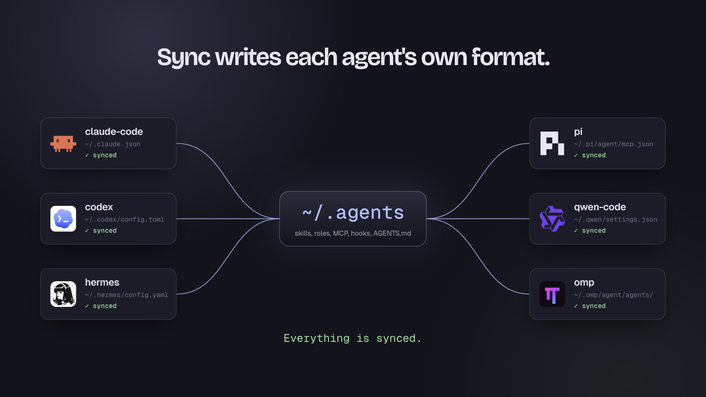

# tackroom

Dotfiles for your AI agents. One `~/.agents` repo, rendered into every coding agent.

[](https://yourconscience.github.io/tackroom/brag.mp4)

[Watch the 23-second tour](https://yourconscience.github.io/tackroom/brag.mp4) · [Website](https://yourconscience.github.io/tackroom/)

[](https://github.com/yourconscience/tackroom/releases) [](https://github.com/yourconscience/homebrew-tap) [](https://www.npmjs.com/package/tackroom) [](https://github.com/yourconscience/tackroom/actions/workflows/ci.yml) [](./LICENSE)

```bash
brew install yourconscience/tap/tackroom   # Homebrew
npm install -g tackroom                    # npm, or run once with: npx tackroom setup
```

**[Overview & comparison →](https://yourconscience.github.io/tackroom/)** · [Releases](https://github.com/yourconscience/tackroom/releases) · [Docs](docs/)

## Why

If you use more than one coding agent, you maintain the same skills, MCP servers, hooks, and roles in a different place and format for each one. Copying them by hand drifts within a week. Skills have converged on one open convention ([agentskills.io](https://agentskills.io)), plugins on [agent-plugins-spec](https://agent-plugins.org), and root instructions on `AGENTS.md` — but every harness still stores and renders config in its own native format. tackroom applies the dotfiles pattern to that last mile: one versioned repo, rendered natively per harness, with memory tooling built in.

## Quick start

```bash
brew install yourconscience/tap/tackroom   # or: npm install -g tackroom
# no brew/npm? curl -fsSL https://raw.githubusercontent.com/yourconscience/tackroom/main/scripts/install.sh | sh
tackroom setup                             # detect harnesses, import, first sync
```

`setup` creates `~/.agents`, detects installed harnesses, imports existing content by copy after a per-item review, and runs the first sync. To carry the setup to other machines, add a private git remote and repeat — details in [docs/setup.md](docs/setup.md).

```bash
tackroom status   # per-harness sync state
tackroom doctor   # health checks: frontmatter, lock pins, audits, hooks
```

## What it syncs

Five surfaces, each rendered into the harness's own format — tackroom does not invent compatibility files a harness cannot consume:

| Harness | Skills | Roles | MCP | Hooks | Plugins |
|---|---|---|---|---|---|
| Amp | yes, config-driven | --⁑ | yes | --⁑ | -- |
| Claude Code | yes | yes | yes | yes | -- |
| Codex | yes | yes | yes | yes | planned |
| Factory Droid | yes | yes | yes | yes | -- |
| Hermes | yes | -- | yes | yes | -- |
| OpenCode | yes† | yes | yes | -- | -- |
| Qwen Code | yes, config-driven | yes | yes | yes | skills + MCP§ |
| OMP (pi fork) | yes | yes | yes | --‡ | -- |
| Pi* | yes | yes* | yes* | -- | skills + MCP* |

\* Vanilla [pi](https://github.com/earendil-works/pi) gains managed roles through `pi-subagents` and managed MCP/Agent Plugin projection through `pi-mcp-adapter`. A Pi target can also declare a pinned `packages` list; `sync` writes that list to `~/.pi/agent/settings.json`, and Pi installs missing packages on its next startup. Tackroom does not install the Pi executable itself. The OMP fork remains a separate target.

```yaml
agents:
  - name: pi
    enabled: true
    detect: pi
    skill_root: ~/.pi/agent/skills
    agent_root: ~/.pi/agent/agents
    packages:
      - npm:pi-mcp-adapter@2.33.0
      - npm:pi-subagents@0.67.0
```
† OpenCode reads `~/.agents/skills/` natively; its only hook surface is a JS plugin API.
‡ OMP has no managed hook surface yet; register memory hooks manually if needed.
§ Qwen Code natively loads Agent Plugins v1 skills and MCP servers; tackroom manages those same surfaces without rewriting the plugin.
⁑ Amp's hook and role surfaces use plugin-based models incompatible with tackroom' script-based hooks and per-agent role files.

OpenClaw is not currently supported. Native skill discovery from `~/.agents/skills` may work due to OpenClaw's multi-tier skill precedence, but this is unverified and unmanaged. A managed harness entry is planned for a future release. A "yes" above only appears after end-to-end verification.

## Skills

A skill is a directory under `~/.agents/skills/` with a `SKILL.md` ([agentskills.io](https://agentskills.io) convention) — create once, appears everywhere. External skills are treated like dependencies: pinned in `tackroom.lock`, materialized for diffing, audited by `tackroom doctor`. Details in [docs/skills.md](docs/skills.md).

## Memory

Pick a tier during `setup`: `off`, `basic` (session digests), or `memsearch` (indexed search). On top of that, `sync` builds two Go helpers into `~/.local/bin`: `knowledge-sync` (vault git sync) and `rem`:

```bash
rem add -src claude "prefers pnpm for Node work"   # capture a candidate fact anywhere
rem dream                                          # consolidate candidates into review reports
rem dream --apply                                  # collapse exact-duplicate records (backup + commit)
rem search "quota preferences"                     # semantic search over captured memory
```

Candidates are inert until you promote them into durable instructions — consolidation is report-first by design, because automatically rewriting memory is how agents quietly corrupt their own instructions. `sync` keeps the managed memory code layer current and removes files a release no longer ships; anything you edited yourself is reported and left alone. Design notes in [docs/memory.md](docs/memory.md).

## Roles

Markdown role definitions in `~/.agents/agents/`, rendered to each harness's native format (Claude Markdown, Codex TOML, Qwen Markdown, Droid). Generic `model` tiers (`haiku`/`sonnet`/`opus`) render natively for Claude and Droid; Codex omits them and uses its own default unless a per-harness override pins an exact id. Six starter roles ship with the tool; yours win on name collision. Details in [docs/roles.md](docs/roles.md).

## Commands

```bash
tackroom setup    [--memory off|basic|memsearch] [--yes] [--dry-run] [--json]
tackroom status   [--verbose] [--agents ...]
tackroom sync     [--pull] [--agents ...]
tackroom doctor   [--e2e] [--agents ...]
tackroom config   validate|print
tackroom view     [--addr 127.0.0.1:8765] [--no-open] [--secure-cookie] [--ssh-host user@host]  # loopback web config UI
tackroom skill    new|list|info|update|promote
tackroom publish  [--target NAME] [--skills a,b] [--dry-run] [--json] [--yes]  # push skills to a remote registry
tackroom mcp      list|add|import|remove
tackroom hook     list [query] | remove [--dry-run] <query>
```

## Companion tools

tackroom does one job. These tools pair well with it; install and run them on their own:

| Tool | Purpose | Run |
|---|---|---|
| [HarnessKit](https://github.com/RealZST/HarnessKit) | Inspect and audit skills, MCP servers, hooks, and native harness configuration | `hk serve` |
| [AgentsView](https://github.com/kenn-io/agentsview) | Search and replay sessions; inspect tool telemetry, token usage, and estimated cost | `agentsview serve` |

Treat HarnessKit as read-mostly: its enable, disable and deploy actions bypass tackroom, so reconcile any changes with `tackroom sync`.

`tackroom skill list` remains the built-in provenance view for each harness skill root. It reports managed links, foreign symlinks, unmanaged directories, drift, broken links, and estimated context cost.

`tackroom hook list [query]` inventories native hook registrations and marks canonical entries as managed and missing script targets as stale. To clean up a hook installed outside tackroom, preview with `tackroom hook remove --dry-run <query>`, then rerun without `--dry-run`; unrelated hook entries are preserved. `tackroom doctor` reports stale native hooks, and `tackroom sync` reconciles the remaining canonical hooks afterward.

## Installing skills without tackroom

A tackroom-format repo also works as a plain skills source. Anyone can copy individual skills into their harness of choice with the skills.sh installer, no tackroom install needed:

```bash
npx skills add yourconscience/myagents -s tackroom --copy   # verified: copies cleanly, no symlinks
```

That path copies editable files (the "fork" model); tackroom users get the symlink-to-canonical model with lock-pinned updates. Pick one per machine — installing both leaves you with every skill twice.

## Configuration

`~/.agents/tackroom.yaml` is the single source of truth; `setup` fills in detected harnesses. Resolution order: `--config <path>` → `$TACKROOM_HOME/tackroom.yaml` → `~/.agents/tackroom.yaml`; never walks the current project. Machine-local entries overlay via `tackroom.local.yaml`. Managed entries are marked in native configs; anything else is left untouched.

### Canonical config authoring

`tackroom view` (browser web UI) edits the resolved canonical YAML through a
review-first flow. Shared and `tackroom.local.yaml` are separate editable
layers; the effective view is read-only. Structured edits preserve comments and
unknown fields, and a save never runs `sync` implicitly. `tackroom config`
validates or prints the result.

```bash
tackroom view --no-open --addr 127.0.0.1:8765   # loopback web UI, print the URL
tackroom config validate
tackroom config print
```

The `view` web server is loopback-only, session-cookie authenticated (a
one-time startup token swapped for an `HttpOnly`, `SameSite=Strict` cookie),
CSRF- and origin-checked on mutations, guards saves by revision, and keeps sync
as a separate preview/confirm step. It prints the tokenized URL on its own line
and opens your default browser locally; `--no-open` skips that, and
`--ssh-host user@host` (or an SSH session, via `SSH_CONNECTION`) prints an
`ssh -L` tunnel command for reaching the loopback UI from another machine. For
deliberate HTTPS tailnet access, expose the loopback listener yourself:

```bash
tackroom view --no-open --secure-cookie --addr 127.0.0.1:8765
tailscale serve --bg --set-path /tackroom http://127.0.0.1:8765
```

## Releases

Releases are cut from `main` after the release PR is reviewed and merged, and only with explicit approval:

```bash
scripts/release.sh vX.Y.Z    # verify + tag; CI publishes binaries, brew tap, npm
```

The script refuses to run unless the tree is clean, `HEAD` matches `origin/main`, the tag is strict `vMAJOR.MINOR.PATCH`, and every check passes. Pushing the tag starts `.github/workflows/release.yml`, which re-verifies the tag against `main` and a green `ci.yml` run, waits on the protected `release` environment, then publishes binaries, the Homebrew tap, and the npm wrapper.

## Documentation

- [Overview & comparison](https://yourconscience.github.io/tackroom/) — landing page, sync matrix, positioning
- [docs/setup.md](docs/setup.md) — first-run walkthrough, review screen, multi-machine setup
- [docs/skills.md](docs/skills.md) — authoring skills, external pins and audits
- [docs/roles.md](docs/roles.md) — role format, model tiers, per-harness overrides
- [docs/memory.md](docs/memory.md) — memory tiers, rem workflow, vault layout
- [docs/comparison.md](docs/comparison.md) — how tackroom differs from rulesync, ruler, openskills
- [Troubleshooting](docs/troubleshooting.md)
- [memory/README.md](memory/README.md) — memory layer layout, hooks, and tools

Project-level generators (rulesync, ruler) win on tool breadth; tackroom is user-level — one private repo, nine targets deep, pinned externals, review-first memory. Full table in [docs/comparison.md](docs/comparison.md).

## License

[MIT](./LICENSE)
